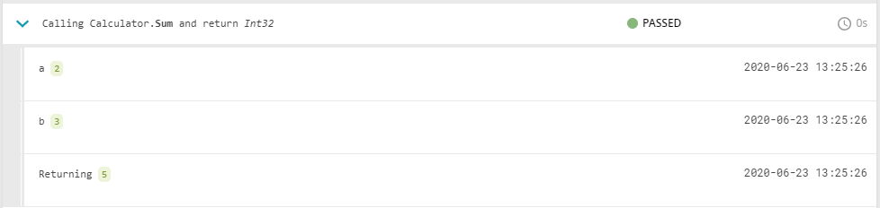

Aim of this experimental project is to provide a way for adding more structured information about tests execution without coding. It modifies test at build time and automatically "inserts" additional reporting capabilities.


# How to use

Install `ReportPortal.Extensions.Insider.Sdk` nuget package and add **[Insider]** attribute for method which you want to see in the report.

```csharp
using ReportPortal.Extensions.Insider;

...

[Insider]
public int Sum(int a, int b)
{
  return a + b;
}
```

Each time when this method is called by tests you will see 


Or define more meanful operational name.
```cshar
[Insider("Adding two numbers")]
```


# Future
- Fully automatic way to report all methods (no need to add [Insider] attribute)
- Configurable rules what namespaces/types/methods we want to see in the report
- More useful way to report complex objects
- Support async methods
- Any else?